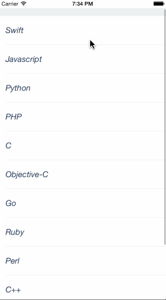

PullToRefreshSwift
==================

[](https://developer.apple.com/iphone/index.action)
[](https://developer.apple.com/swift)
[](http://mit-license.org)
[](https://github.com/dekatotoro/PullToRefreshSwift/issues?state=open)


iOS Simple PullToRefresh Library.



##Installation

####CocoaPods
```
pod 'PullToRefreshSwift'
```

####Manually
Add the following files to your project. 
`pulltorefresharrow.png`
`PullToRefreshView.swift`
`PullToRefreshConst.swift`
`UIScrollViewExtension.swift`


##Usage

###Setup

In your UIViewController Including UITableView, UICollectionView, UIScrollView:
```swift
  override func viewDidLoad() {
        self.tableView.addPullToRefresh({ [weak self] in
            // refresh code
            
            self?.tableView.reloadData()
            self?.tableView.stopPullToRefresh()
        })
  }
```

You can use PullToRefreshOption class at addPullToRefresh func option parameter:
```swift
  override func viewDidLoad() {
       let options = PullToRefreshOption()
        options.backgroundColor = UIColor.blueColor()
        options.indicatorColor = UIColor.whiteColor()
        
        self.tableView.addPullToRefresh(options: options, { [weak self] in
            // some code
            
            self?.tableView.reloadData()
            self?.tableView.stopPullToRefresh()
        })
        
  }
```
  
If you want to fixed pulltoRefreshView, please implement scrollViewDidScroll.
```swift
  func scrollViewDidScroll(scrollView: UIScrollView) {
    self.tableView.fixedPullToRefreshViewForDidScroll()
  }  
```
  
If you want to use the custom const, please change the PullToRefreshConst class.
```swift
struct PullToRefreshConst {
    static let tag = 810
    static let alpha = true
    static let height: CGFloat = 80
    static let imageName: String = "pulltorefresharrow.png"
    static let animationDuration: Double = 0.4
    static let fixedTop = true // PullToRefreshView fixed Top
}
```
If you want to use the custom option, please change the PullToRefreshOption class.
You can use this class at addPullToRefresh func option parameter.
```swift
class PullToRefreshOption {
    var backgroundColor = UIColor.clearColor()
    var indicatorColor = UIColor.grayColor()
    var autoStopTime: Double = 0.7 // 0 is not auto stop
    var fixedSectionHeader = false  // Update the content inset for fixed section headers
}
```

## Requirements
Requires Swift3.0 and iOS 8.0 and ARC.  
If you are developing in the Swift1.1 ~ 2.3, please use branch of Swift1.1 ~ Swift2.3.  

## Features
- Highly customizable
- Complete example
- Refactoring

## Contributing

Forks, patches and other feedback are welcome.

## Creator

[Yuji Hato](https://github.com/dekatotoro) 
[Blog](http://buzzmemo.blogspot.jp/)

## License

PullToRefreshSwift is available under the MIT license. See the LICENSE file for more info.
